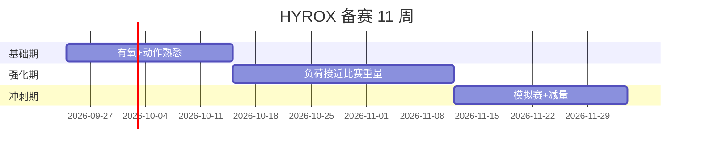

# 训练记录（示例 · markdown 渲染演示）

> 这个文件展示 GitHub 对 markdown 的原生渲染：表格、任务列表、折叠块、mermaid 图表。

## 本周计划

- [x] 9/22 SkiErg + 跑
- [x] 9/24 Wall Balls
- [ ] 9/26 Farmers Carry
- [ ] 9/28 Sled Push/Pull 组合

## 8 站点目标重量（女子双人官方）

| 站点 | 项目 | 目标 |
|------|------|------|
| 1 | SkiErg | 1000 m |
| 2 | Sled Push | 102 kg × 50 m |
| 3 | Sled Pull | 78 kg × 50 m |
| 4 | Burpee Broad Jumps | 80 m |
| 5 | Rowing | 1000 m |
| 6 | Farmers Carry | 2×16 kg × 200 m |
| 7 | Sandbag Lunges | 10 kg × 100 m |
| 8 | Wall Balls | 4 kg × 100 次 |

每站之间穿插 1 km 跑，共 8 km。

点击展开：9/22 训练明细

- SkiErg 1000m：4:52
- 跑 1km：5:10
- 共 3 组，总用时 32:10
- 体感：最后一组后程掉速，下次前两组压一下配速

## 备赛时间线

